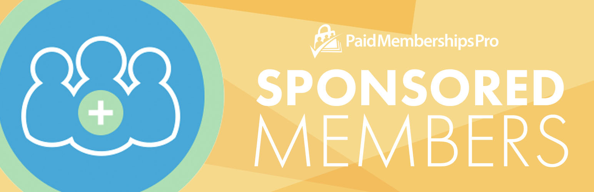

# [Paid Memberships Pro - Sponsored/Group Members](https://www.paidmembershipspro.com/add-ons/pmpro-sponsored-members/) #
[comment]: # (Generate badges from shields.io, only works for .org plugins to get other stats etc. We'd have to create our own endpoints for Premium plugins)

> :warning: **Note:** This Add On is being deprecated in favor of the new [Group Accounts Add On](https://www.paidmembershipspro.com/add-ons/group-accounts/) that replaces the code-based system in Sponsored Members with more features and no-code setup. There will be no new development on Sponsored Members.

### Welcome to the Paid Memberships Pro - Sponsored/Group Members GitHub Repository
For groups or institutions that allow a member to purchase a block of linked accounts. The Add On provides the primary member’s with a code to distribute to their team for use during registration. The primary member can also automatically register the child accounts during checkout.

For more information please visit [www.paidmembershipspro.com/add-ons/pmpro-sponsored-members/)](https://www.paidmembershipspro.com/add-ons/pmpro-sponsored-members/)

## Installation ##
For detailed installation steps, visit the [documentation](https://www.paidmembershipspro.com/add-ons/pmpro-sponsored-members/) page.

1. Download the current development ZIP file directly: `https://github.com/strangerstudios/pmpro-sponsored-members/archive/dev.zip`

**Please ensure that once installing this version of the plugin to remove `-dev` from the plugin's folder name.**

## Bugs ##
If you find an issue/bug, let us know by [creating a detailed GitHub issue](https://github.com/strangerstudios/pmpro-sponsored-members/issues/new).

## Support ##
This is a developer's portal for Paid Memberships Pro - Sponsored/Group Members. We do not offer support on this channel. **Any support related questions should be directed to [www.paidmembershipspro.com/add-ons/pmpro-sponsored-members/)](https://www.paidmembershipspro.com/add-ons/pmpro-sponsored-members/).**

## Contributing to Paid Memberships Pro - Sponsored/Group Members ##
We encourage and welcome any contribution to Paid Memberships Pro - Sponsored/Group Members. Please read the [guidelines for contributing](https://github.com/strangerstudios/pmpro-sponsored-members/blob/dev/.github/CONTRIBUTING.md) to this repository.

There are various **ways to the help development** of Paid Memberships Pro - Sponsored/Group Members:

1. Report [bugs/issues](https://github.com/strangerstudios/pmpro-sponsored-members/issues/new) on GitHub.
2. Work on any issues by submitting a Pull Request.

Here are some ways for **non-developers to contribute** to Paid Memberships Pro - Sponsored/Group Members:

1. Translate Paid Memberships Pro - Sponsored/Group Members into your own [language](https://www.paidmembershipspro.com/paid-memberships-pro-in-your-language/).
2. [Purchase a plus membership](https://paidmembershipspro.com/pricing) to help fund ongoing development and bug fixes.
